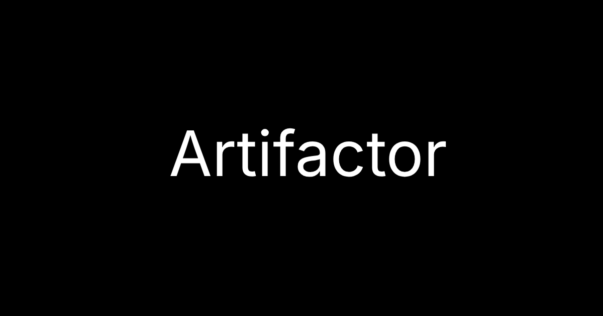
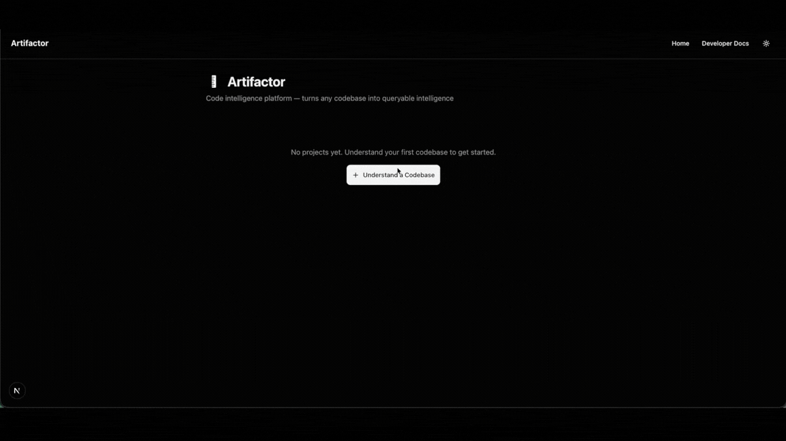

# Artifactor

Open-source code intelligence infrastructure. Builds a programmable Intelligence Model from any codebase — queryable by AI agents, your team, or your own tooling.

Artifactor combines tree-sitter static analysis with LLM inference to produce a structured Intelligence Model: a knowledge graph of entities and relationships, a reasoning graph of purposes and business rules, and 13 documentation sections — each backed by verifiable citations to your source code. It runs on your infrastructure, stores nothing in the cloud, and works with any LLM backend.



## What You Get

Point Artifactor at a repository. It builds three layers:

### Intelligence Model

A structured knowledge graph and reasoning graph built from dual-path analysis (AST + LLM cross-validation). Entities, relationships, call graphs, dependency graphs, business rules, and risk patterns — all with dynamic confidence scores (0-100%). Every finding cites the exact file, function, and line. Low-confidence claims are flagged, not hidden.

### Agent Integration

An MCP server (10 tools, 5 prompts) that feeds your Intelligence Model to AI coding agents — Claude, Cursor, Copilot, or any MCP-compatible tool. A REST API (30 endpoints) for programmatic access. Five built-in playbooks for guided workflows: code review, bug diagnosis, test generation, migration planning, and repo onboarding.

### Documentation

13 citation-grounded sections covering executive overview, system architecture, data models, API specifications, features, user stories, security analysis, and more. Exported as Markdown, HTML, PDF, or JSON.

## How It Works

Two independent analysis paths run against your code: **static analysis** (tree-sitter AST parsing) extracts structure deterministically, while **LLM inference** extracts meaning probabilistically. Results are cross-validated using token-based matching — entities confirmed by both paths get high confidence, single-source findings get lower scores. Citations are verified against the source tree before output.

For the full technical deep-dive, see [ARTIFACTOR.md](ARTIFACTOR.md).

## Quickstart

### Prerequisites

- Python 3.12+
- An LLM API key (OpenAI by default, or any [litellm-supported provider](https://docs.litellm.ai/))

### Install & Run

```bash
uv sync
export OPENAI_API_KEY=your-key-here
artifactor analyze /path/to/your/repo
```

Export in other formats:

```bash
artifactor analyze /path/to/repo --format html -o report.html
artifactor analyze /path/to/repo --format pdf -o report.pdf
artifactor analyze /path/to/repo --format json -o report.json
```

### Docker

```bash
docker compose up              # Build + run (backend:8000, frontend:3000)
```

Open `http://localhost:3000` for the UI. The frontend proxies `/api/*` to the backend. Data persists in `./data` via mounted volumes.

For standalone Docker, environment variables, and details, see [ARTIFACTOR.md → Docker](ARTIFACTOR.md#docker).

## Development

```bash
./dev.sh                        # Start backend + frontend (Ctrl-C to stop both)
```

Or manually:

```bash
uv run uvicorn artifactor.main:app --reload   # Backend  (port 8000)
cd frontend && pnpm install && pnpm dev        # Frontend (port 3000)
```

See [CONTRIBUTING.md](CONTRIBUTING.md) for tests, linting, and PR guidelines.

## Documentation

For comprehensive technical documentation, see **[ARTIFACTOR.md](ARTIFACTOR.md)**:

- REST API (30 endpoints) and MCP server (10 tools, 5 prompts)
- Chat & RAG pipeline with hybrid vector + keyword search
- Architecture patterns and design axioms
- All 13 section generators and export formats
- Configuration reference (environment variables)
- Project structure and development workflow

## Why Artifactor

- **Infrastructure, not a destination** — MCP server, REST API, and playbooks. Not a web viewer you visit — infrastructure you build on.
- **Your code, your Intelligence Model** — runs on your machine, no telemetry, no cloud storage, read-only analysis. Your code never leaves your infrastructure. See [Security Policy](SECURITY.md).
- **Pluggable LLM** — any [litellm-supported provider](https://docs.litellm.ai/) works: OpenAI, Anthropic, Google, Azure, local Ollama. No vendor lock-in.
- **Verified citations** — every claim cites the exact file, function, and line. Dual-path cross-validation (AST + LLM) catches what either path alone would miss.
- **Honest confidence** — every finding carries a confidence score. Low-confidence claims are flagged, not hidden. Artifactor tells you what it doesn't know.
- **Engineering rigor** — 619+ tests across a 4-tier test pyramid, strict type checking, protocol-based architecture, frozen value objects.

## Links

- [Complete Reference](ARTIFACTOR.md)
- [Contributing Guide](CONTRIBUTING.md)
- [Security Policy](SECURITY.md)

## License

[MIT](LICENSE)

---

Built by Patrick Pena, Agenisea™ 🪼
